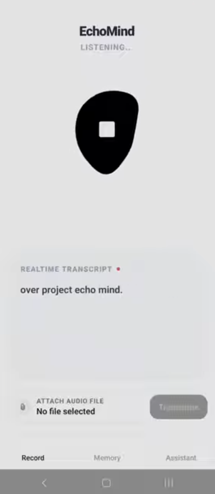
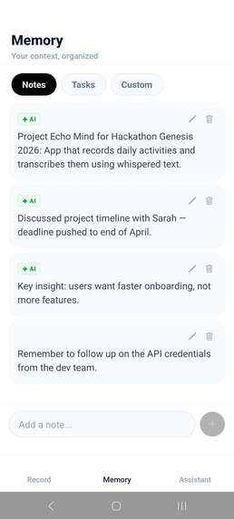

# EchoMind — Android Embedded AI Assistant

> A fully on-device AI assistant for Android. Records your voice, transcribes it with Whisper, extracts structured memory with Gemma 3, and lets you query everything through a local chat interface — no cloud, no internet required.

<p align="center">
  
  &nbsp;&nbsp;
  
  &nbsp;&nbsp;
  
</p>

---

## Overview

EchoMind runs two neural networks locally on your Android device, connected into a continuous cognitive pipeline:

1. **Record** — persistent foreground service captures audio even when the screen is locked or the app is backgrounded
2. **Transcribe** — Whisper converts speech to text entirely on-device via `whisper.rn`
3. **Extract** — Gemma 3 (1B GGUF) reads the transcript and writes structured notes, todos, and facts into a local memory store
4. **Chat** — a local LLM assistant with full memory context injected on every message

---

## Technical Details

### On-Device Inference Pipeline

Both models run as native GGUF runtimes (`whisper.rn` / `llama.rn`) communicating to JavaScript via the React Native bridge. Audio is captured as PCM, encoded to WAV, and resampled to 16kHz before being passed to Whisper. The output transcript feeds directly into Gemma 3 for structured memory extraction.

```
Microphone PCM → WAV encode → 16kHz resample → Whisper inference → transcript
                                                                         ↓
                                                      Gemma 3 structured extraction
                                                                         ↓
                                                         Memory store (append-only)
```

### Android 14 Background Recording

Android 14 terminates standard foreground services after ~3 minutes. EchoMind uses a `microphone`-typed persistent foreground service via Notifee to keep the audio session alive indefinitely. Recording state is managed outside the React component tree so it survives tab switches and screen lock.

### Selective Memory Extraction

The LLM triggers after a file transcription completes, or every ~400 characters during live recording, with a final pass on stop. This keeps battery usage low while still capturing key information in real time. Extraction is fire-and-forget and never blocks the UI.

### Shared Memory Store

All tabs share a single module-level memory store. Notes added during recording are immediately available as chat context — no prop drilling, no global state library needed.

### Live Audio Visualization

The animated blob on the Record screen is a spline-interpolated SVG path driven by React Native Reanimated worklets on the UI thread. Each of 8 control points follows a periodic offset:

```
P_i(t) = R · (sin(ωt + φᵢ) · scale + 1)
```

`scale` increases with recording amplitude, giving real-time visual feedback at 60fps.

---

## Architecture

```
app/
  (tabs)/
    index.tsx        # Record tab — live + file transcription, memory extraction
    chat.tsx         # Chat tab — memory-augmented local LLM chat
    memory.tsx       # Memory tab — notes, todos, facts
    models.tsx       # Model manager — download and load Whisper + Gemma

services/
  whisper-service.ts     # Whisper.rn wrapper, WAV encoding, 16kHz resampling
  llm-service.ts         # Gemma 3 inference, memory extraction, chat completion
  memory-store.ts        # Append-only store with subscriber notifications
  background-service.ts  # Notifee foreground service lifecycle
  native-runtime.ts      # Capability detection for native modules
```

---

## Stack

| Layer | Technology |
|---|---|
| Framework | React Native + Expo (bare workflow) |
| Speech-to-Text | `whisper.rn` — native GGUF, fully offline |
| Language Model | `llama.rn` — Gemma 3 1B GGUF |
| Background audio | `@notifee/react-native` foreground service |
| Animation | React Native Reanimated 4 (UI thread worklets) |
| Graphics | `react-native-svg` |
| Navigation | Expo Router v6 |
| Language | TypeScript |

---

## Getting Started

### Prerequisites

- Node 18+
- Android Studio + Android SDK (API 34+)
- Physical Android device (emulators are too slow for GGUF inference)

### Setup

```bash
git clone https://github.com/ysf-ad/android-embedded-assistant.git
cd android-embedded-assistant/gen2026

npm install
npx expo prebuild --clean -p android
npx expo run:android
```

### Models

Download from the in-app **Models** tab or place GGUF files manually on device storage:
- **Whisper**: `ggml-base.en.bin`
- **Gemma**: `gemma-3-1b-it-q4_k_m.gguf`

---

## Known Limitations

- Android only — iOS foreground audio service APIs differ significantly
- Memory resets on cold start (AsyncStorage persistence planned)
- Model files are large (~600MB Whisper + ~800MB Gemma Q4) and downloaded separately
